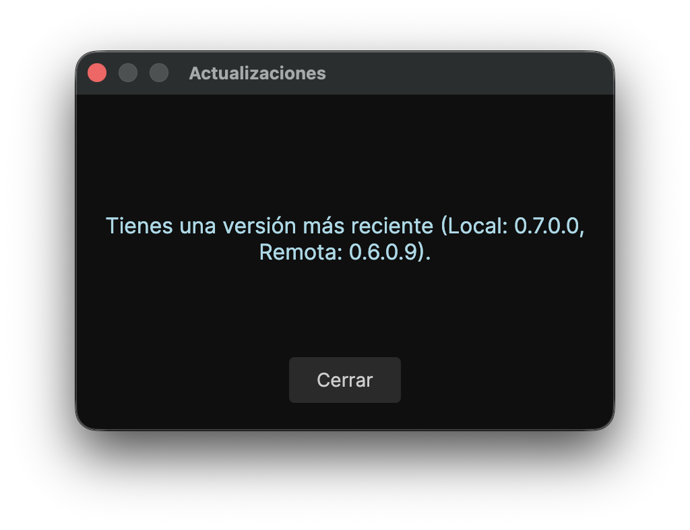

# Ultraudio 🎵

[](https://github.com/RichyKunBv/Ultraudio)
[](https://github.com/RichyKunBv/Ultraudio)
[](https://github.com/RichyKunBv/Ultraudio/blob/main/LICENSE)
[](https://www.un4seen.com/bass.html#license)
[](https://dotnet.microsoft.com/es-es/download/dotnet/10.0)
[](https://avaloniaui.net)


Ultraudio es un reproductor de audio Hi-Fi "Bit-Perfect" diseñado específicamente para formatos sin pérdida (lossless). Desarrollado con el objetivo de ofrecer la máxima calidad de sonido directamente a tu DAC (Digital-to-Analog Converter), evitando alteraciones en la señal de audio original.

## ✨ Características Principales

- **Bit-Perfect Audio**: Reproducción exacta, entregando la señal a tu DAC con la mayor fidelidad posible.
- **Soporte Amplio de Formatos**: Compatible con formatos Lossless y Hi-Res como FLAC, WAV, AIFF, y DSD (DSF/DFF).
- **Reproducción de CD**: Soporte nativo para lectura y reproducción de audio desde discos compactos.
- **Gapless Playback & CUE**: Reproducción continua sin pausas entre pistas y soporte completo de hojas CUE para álbumes.
- **Visualizador de Espectro**: Análisis de frecuencias de audio (FFT) en tiempo real integrado en la interfaz.
- **Gestión Avanzada de Librería**: Escaneo veloz con lectura de metadatos (incluyendo ReplayGain), extracción automática de portadas (Cover Art), registro de historial y búsqueda filtrada.
- **Gestión de Listas de Reproducción**: Guarda tus listas en formato `.m3u8`, limpia la cola de reproducción y reordena las pistas a tu gusto.
- **Ventana de Configuración Avanzada**: Selector de DAC (dispositivo de salida) dedicado y persistencia de preferencias.
- **Manual Integrado**: Documentación completa de uso y funciones accesible directamente desde los ajustes.
- **Control y Accesibilidad**: Atajos de teclado para navegación y volumen, soporte nativo de Teclas Multimedia (Media Keys), integración en la barra de menú (macOS) y servicio de control HTTP remoto.
- **Verificación de Actualizaciones**: Notificación de nuevas versiones disponibles.
- **Multiplataforma**: Construido sobre Avalonia UI y .NET 10, para Windows, macOS y Linux.

## 📸 Interfaz y Uso

### Atajos de Teclado
- **Espacio**: Reproducir / Pausar
- **← / →**: Atrasar / Adelantar 5 segundos
- **Ctrl + ← / →**: Pista Anterior / Siguiente
- **Ctrl + ↑ / ↓**: Subir / Bajar volumen
- **Ctrl + M**: Silenciar (Mute)
- **Ctrl + S / R / B**: Aleatorio / Repetir / Favorito
- **Ctrl + F**: Buscar en la lista
- **Ctrl** es **Command** para macOS.

### Interfaz Principal


### Carga y Reproducción de Pistas

<br/>


### Selección de Directorio Musical

<br/>


### Ventana de Configuración (Preferencias y Selección de DAC)

<br/>

<br/>


### Notificación de Actualizaciones


### Integración con macOS (Barra de Menú)


## 🛠️ Tecnologías y Dependencias

El proyecto está desarrollado en **C# (.NET 10)** y se apoya en las siguientes bibliotecas y tecnologías:

- [Avalonia UI](https://avaloniaui.net/): Framework de interfaz de usuario para aplicaciones de escritorio multiplataforma.
- [BASS Audio Library](http://www.un4seen.com/): Motor de audio para reproducción. Se usan los wrappers `ManagedBass` y `ManagedBass.Flac`.
- [TagLib#](https://github.com/mono/taglib-sharp): Herramienta para extraer metadata
- [Internet](https://github.com/RichyKunBv/Ultraudio/releases/latest): Herramienta para actualizar la aplicacion

## ⬇️ Descargas / Instalación

Puedes descargar los binarios precompilados listos para usar desde la sección de **[Releases](https://github.com/RichyKunBv/Ultraudio/releases/latest)**.

Están disponibles para todos los sistemas operativos principales (**Windows, macOS y Linux**) en las arquitecturas más utilizadas:
- **x64** (Procesadores Intel y AMD)
- **arm64** (Apple Silicon y procesadores ARM)

```sh
# Para macOS, quitar el atributo de cuarentena si no se puede abrir la app
sudo xattr -cr /Applications/Ultraudio.app
```

## 🚀 Cómo compilar y ejecutar

### Requisitos Previos
- [.NET 10 SDK](https://dotnet.microsoft.com/download/dotnet/10.0)
- Las bibliotecas nativas de BASS están configuradas en el directorio `lib/` y se copian automáticamente al compilar según el Sistema Operativo.

### Compilación y Ejecución (General)
Asegúrate de ejecutar los comandos desde el directorio raíz del proyecto (donde se encuentra `Ultraudio.slnx`):

```bash
# Compilar el proyecto
dotnet build

# Ejecutar el reproductor
dotnet run --project src/Ultraudio.csproj
```

### Usando Makefile (Linux & Unix-like)

Para usuarios de sistemas basados en Unix (Linux, macOS), el proyecto incluye un `Makefile` que simplifica la compilación, ejecución y permite instalar la aplicación de forma nativa en el sistema:

```bash
# Compilar el proyecto
make build

# Ejecutar el reproductor
make run

# Empaquetar la aplicación
make package

# Instalar la aplicación en el sistema (añade icono y acceso directo .desktop)
sudo make install

# Desinstalar la aplicación
sudo make uninstall
```

Para la creación y empaquetado de la aplicación, dispones también de scripts automatizados en el directorio `scripts/`:

- **macOS**: `scripts/build_ultraudio_in_macos.sh` (empaqueta como `.app` nativa y también compila para Windows y Linux).
- **Windows**: `scripts/PRE_build_ultraudio_in_windows.ps1` (facilita la creación de paquetes para múltiples sistemas y arquitecturas).
- **Linux**: `scripts/PRE_build_ultraudio_in_linux.sh` (facilita la creación de paquetes para múltiples sistemas y arquitecturas).

> **Nota:** Todos los scripts se encuentran en la carpeta `scripts/`. En los scripts de Linux y Windows no se puede firmar la aplicación para macOS, ya que este paso es exclusivo y debe realizarse desde una Mac.

## Licencia
Este proyecto está bajo la licencia Apache 2.0, a excepción de las 
bibliotecas de audio BASS (ubicadas en `/lib`), las cuales son propiedad 
de Un4seen Developments y se incluyen únicamente para uso no comercial.
Cualquier persona que decida hacer un fork de este proyecto o distribuirlo con fines comerciales es absolutamente responsable de adquirir la licencia comercial correspondiente de BASS Audio Library o remover sus dependencias del código.


---

<details>
<summary>TESTS — Entornos de Prueba y Verificación</summary>

<br/>

> **Nota:** Este proyecto ha sido probado y verificado en las siguientes configuraciones de hardware y software.  

| Simbolo | Significado |
| :---: | :--- |
| ✅ | Verificado |
| ❌ | No funciona |
| ⬜  | Pendiente |

---

### Windows

<details>
<summary>&nbsp;&nbsp;ARM</summary>

<br/>

| ✅ | Sistema Operativo | Version SO | CPU | RAM | Version de app | Notas |
| :---: | :--- | :--- | :--- | :--- | :--- | :--- |
| ✅ | Windows 11 Pro | 25h2 | 4 núcleos | 4 GB | PRE v1.0.0 | Virtualizado en VMware Fusion, sin instalar nada de .NET |

</details>

<details>
<summary>&nbsp;&nbsp;x86_64</summary>

<br/>

| ✅ | Sistema Operativo | Version SO | CPU | RAM | Version de app | Notas |
| :---: | :---: | :--- | :--- | :--- | :--- | :--- |
| ⬜ | Windows 11 Home | 25h2 | i7-1255U | 16 GB |  |  |
| ✅ | Windows 10 Pro | 22h2 | i5-4200M | 16 GB | v0.3.1 | soporte extendido y sin dotnet |

</details>

---

### macOS

<details>
<summary>&nbsp;&nbsp;ARM</summary>

<br/>

| ✅ | Sistema Operativo | Version SO | CPU | RAM | Version de app | Notas |
| :---: | :---: | :--- | :--- | :--- | :--- | :--- |
| ✅ | macOS 27 Golden Gate | 27 | M1 | 8 GB | PRE v1.0.0 | Beta de macOS con dotnet 10 instalado |
| ✅ | macOS Tahoe | 26.5.1 | A18 Pro | 8 GB | PRE v1.0.0 | dotnet 10 instalado |

</details>

<details>
<summary>&nbsp;&nbsp;x86_64</summary>

<br/>

| ✅ | Sistema Operativo | Version SO | CPU | RAM | Version de app | Notas |
| :---: | :---: | :--- | :--- | :--- | :--- | :--- |
| ✅ | macOS Sequoia | 15.7.7 | i5 (2 Puertos Thunderbolt) | 8 GB | PRE v1.0.0 | dotnet no instalado |

</details>

---

### Linux

<details>
<summary>&nbsp;&nbsp;ARM</summary>

<br/>

| ✅ | Sistema Operativo | Version SO | CPU | RAM | Version de app | Notas |
| :---: | :---: | :--- | :--- | :--- | :--- | :--- |
| ✅ | Fedora | 44 | 4 núcleos | 4 GB | PRE v1.0.0 | Virtualizado en VMware Fusion |

</details>

<details>
<summary>&nbsp;&nbsp;x86_64</summary>

<br/>

| ✅ | Sistema Operativo | Version SO | CPU | RAM | Version de app | Notas |
| :---: | :---: | :--- | :--- | :--- | :--- | :--- |
| ⬜ | Fedora | 44 | i7-1255U | 16 GB |  |  |
| ⬜ | Arch | | i5-5250U | 4 GB |  |  |
| ⬜ | Debian | 13 | Celeron N3350 | 4 GB |  |  |
| ✅ | Fedora | 44 | i5 M520 | 8 GB | PRE v1.0.0 | Clonado y compilado, prueba del lector de CD (si funciona) |

</details>

---

### 🎶 Canciones de Prueba

> Pistas utilizadas para verificar la fidelidad Bit-Perfect de la reproducción.

| # | Nombre | Artista | Álbum | Formato | Version de app que se probó |
| :---: | :--- | :--- | :--- | :--- | :---: |
| 1 | Massive Explosion (Instrumental) | 石元丈晴 | DISSIDIA FINAL FANTASY NT: Ultimate Collector's Edition Official Soundtrack | `FLAC` | v0.1.2 |
| 2 | Over Each Other | Linkin Park | From Zero | `FLAC` | v0.2.0 |
| 3 | In the end | Linkin Park | Hybrid Theory | `FLAC`| 0.3.0 |
| 4 | Faith | Limp Bizkit | Greatest Hits | `FLAC`| 0.3.1 |
| 5 | Take a Look Around | Limp Bizkit | Significant Other | `WAV`| v0.5.0 |

### 🎶 Discos de Prueba

| # | Álbum | Artista | Versión de app |
| :---: | :--- | :--- | :---: |
| 1 | Greatest Hits | Limp Bizkit | v0.6.0 |
| 2 | DISSIDIA FINAL FANTASY NT: Ultimate Collector's Edition Official Soundtrack | 石元丈晴 | v0.6.0 |

### 🎶 Audifonos y Bocinas de Prueba

| # | marca | modelo | tipo | version de app |
| :---: | :--- | :--- | :--- | :---: |
| 1 | Sennheiser | HD599 | acústico abierto circumaurales | v0.5.0 |
| 2 | Apple | Integrados MacBook Air M1 | Bocinas | v0.1.2 |
| 3 | Apple | Integrados MacBook Neo | Bocinas | v0.2.0 |
| 4 | Apple | Integrados MacBook Pro (2019) | Bocinas | v0.3.0 |
| 5 | Apple | Integrados MacBook Pro (2010) | Bocinas | v0.5.0 |
| 6 | Bose | SoundLink Mini | Bocinas | v0.6.0 |

</details>

---

<details>
<summary>NOTAS GENERALES</summary>

**Sobre la reproducción "Bit-Perfect" y el mezclador del Sistema Operativo**

Actualmente, Ultraudio utiliza la salida estándar de la librería de audio (WASAPI en Modo Compartido para Windows), la cual adapta automáticamente la frecuencia de muestreo del dispositivo a la del archivo original para ofrecer una excelente calidad. Sin embargo, en la versión actual la señal aún pasa por el mezclador del sistema operativo (OS mixer). 

Sabemos que en el mundo audiófilo es fundamental contar con rutas de audio de hardware puras. Por lo tanto, el soporte explícito para **WASAPI Exclusive** y **ASIO** (en Windows), así como **ALSA Direct** (en Linux) y **Hog Mode** (en macOS), está estimado para llegar en la **versión 1.1.0**. Esto permitirá saltarse por completo el mezclador del sistema y lograr un verdadero modo Bit-Perfect exclusivo.

**Biblioteca Inteligente (Por definir)**

Está en los planes implementar una gestión de biblioteca más inteligente y automática. La idea es que la aplicación analice una carpeta dedicada (por ejemplo, `Música/Ultraudio`) y detecte u organice el contenido internamente por formatos (FLAC, DSD, WAV, etc.). Esto permitirá a los usuarios tener toda su música y álbumes en una sola carpeta, y disfrutar de una experiencia fluida, cómoda y amigable como la de un reproductor moderno, sin sacrificar la esencia purista del audio. *(Versión por definir)*

</details>